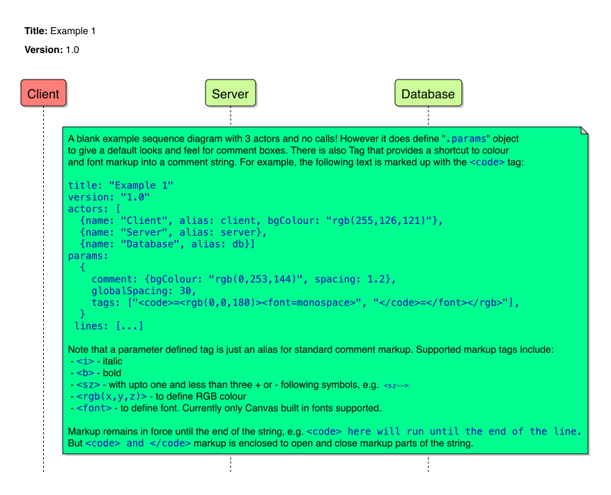

# sequencer
A Node JS tool for building UML sequence diagrams from a JSON or YAML definition.

There is a requirement to be able to define sequence diagrams used in system architecture definitions using a text based language that can be easily managed via source code repository schemes like GIT. Many applications that acheive this are expensive and require significant effort and overhead to maintain. Many online tools are available but are opioniated and p

This tool was written to be able to define sequence diagrams in an entirely textual format, like JSON or YAML, but also provide considerable control over look and feel using metadata within the file. 

## Design

The tool using Node JS. It reads a JSON sequence diagram description, and converts to either PDF or PNG using the Node Canvas solution provided at [https://www.npmjs.com/package/canvas](https://www.npmjs.com/package/canvas). YAML files are first converted to JSON by the tool prior to processing.

The main sections of the sequence diagram metadata description are:
* Title of the sequence diagram
* Version of the sequence diagram. _Note: this is a version presented on the sequyencer image directly and does not relate in any way to repository or file version metadata_
* Description (optional)
* Params. Entities within the diagram itself are assigned presentation metadata from one of 3 sources:
  * The entitiy definition itself, or (if not provided)
  * the Params provided presentation metadata for the entity, or (if not provided)
  * The default built-in opioninated presentation metadata
* The "actors" involved in the sequence diagram. There will be one actor per lifeline.
* The "lines" of the sequence diagram, ordered from the top of the flow to the bottom. Each line is defined with a type:
  * A **call** to define a flow from one actor to another (or itself)
  * A **return** to define the return from one actor to another
  * A **state** that presents a state or constraint on the actors lifeline
  * A **reference** that provides external use case or sequence file references
  * A **blank** line that just provides a define gap if needed between adjacent lines (may also include an unattached comment).
  * A **fragment** line that itself contains any of the above defined lines, given a form (e.g. "alt" condition flow, "loop", etc.), title and condition/definition. 
   * The fragment may also contain a **condtional** line, that breaks the fragment into sections, with the new section having it's own condition/definitino statetment applied.
    
## Usage
Run `node sequencer.js -?`
```
sequencer

  This node application reads JSON or YAML from <stdin> or a file that meets    
  the sequencer specification and generates a PNG or PDF file for the sequence  
  diagram produced                                                              

Options

  -I, --id string           The ID used in the <stderr> log lines produced by the tool if -v is used.                   
  -v, --verbose             If set, then the tool produced verqbose (i.e. debug level) log messages to    
                            <stderr>.                                                                      
  -y, --yaml                If set, the input description (whether from file or <stdin>) is expected to be 
                            in YAML format. If not set, expected to be in JSON format.                    
  -i, --inputFile string    If set, the file to read the input description from. If not set, read from    
                            <stdin>.                                                                      
  -o, --outputFile string   If set, the file to write the processed diagram to. If not set, write to from    
                            <stdout>. If set - but with no filename - then the name of the file is built from 
                            the title and version of the sequence description. If the input is YAML, and  
                            there is no outputFile set, then the tool will write a formatted JSON and     
                            YAML file as well as the PNG or PDF.                                          
  -f, --force               If set, the output file is overwrites any input file of the same name. Only   
                            relevent if -o option is used                                                 
  -d, --pdf                 If set, then the output document will be in PDF format. Otherwise it will be  
                            in PNG format.                                                                
  -?, --help                Print this help
```
A reliable habit for using the tool involves writing the sequence description in YAML, and then title and version the sequence description (use `.title` and `.version`). Then the tool can be operated using:
```
> node sequencer.js -y -i testFile.yaml -o -f
```
Asssume that the `testFile.yaml` file has `title: "Test Sequence Diagram", version: "1.1", ...`. This would result in:
```
-rw-r--r--    1 joeblogs  usergroup   19662  2 Jun 17:40 Test_Sequence_Diagram.1.1.json
-rw-r--r--    1 joeblogs  usergroup  357316  2 Jun 17:40 Test_Sequence_Diagram.1.1.png
-rw-r--r--    1 joeblogs  usergroup   11561  2 Jun 17:40 Test_Sequence_Diagram.1.1.yaml
```

## Example

### Example 1 - A sequence diagram with 3 actors but with no flows!
```
title: "Example 1"
version: "1.0"
actors: [{name: "Client", alias: client, bgColour: "rgb(255,126,121)"}, {name: "Server", alias: server}, {name: "Database", alias: db}]
params:
  {
    comment: {bgColour: "rgb(0,253,144)", spacing: 1.2},
    globalSpacing: 30,
    tags: ["<code>=<rgb(0,0,180)><font=monospace>", "</code>=</font></rgb>"],
  }
lines:
  [
    {
      type: blank,
      height: 0,
      comment:
        [
          'A blank example sequence diagram with 3 actors and no calls! However it does define "<code>.params</code>" object',
          "to give a default looks and feel for comment boxes. There is also Tag that provides a shortcut to colour",
          "and font markup into a comment string. For example, the following text is marked up with the <code>&lt;code&gt;</code> tag:",
          "",
          '<code>title: "Example 1"',
          '<code>version: "1.0"',
          "<code>actors: [",
          '<code>  {name: "Client", alias: client, bgColour: "rgb(255,126,121)"}, ',
          '<code>  {name: "Server", alias: server}, ',
          '<code>  {name: "Database", alias: db}]',
          "<code>params:",
          "<code>  {",
          '<code>    comment: {bgColour: "rgb(0,253,144)", spacing: 1.2},',
          "<code>    globalSpacing: 30,",
          '<code>    tags: ["&lt;code&gt;=&lt;rgb(0,0,180)&gt;&lt;font=monospace&gt;", "&lt;/code&gt;=&lt;/font&gt;&lt;/rgb&gt;"],',
          "<code>  }",
          "<code> lines: [...]",
          "",
          "Note that a parameter defined tag is just an alias for standard comment markup. Supported markup tags include:",
          " - <code>&lt;i&gt;</code> - italic",
          " - <code>&lt;b&gt;</code> - bold",
          " - <code>&lt;sz&gt;</code> - with upto one and less than three + or - following symbols, e.g. <sz--> <code>&lt;sz--&gt;</code>",
          " - <code>&lt;rgb(x,y,z)&gt;</code> - to define RGB colour",
          " - <code>&lt;font&gt;</code> - to define font. The tool only supports Canvas built in fonts currently",
          "",
          "Markup reminas in force until the end of the string, e.g. <code>&lt;code&gt; here will run until the end of the line.",
          "But <code>&lt;code&gt; and &lt;/code&gt;</code> markup is enclosed to open and close markup parts of the string.",
        ],
    },
  ]
```
Would result in sequence diagram:


### Example 2 - Now we add some calls and a return
```
title: "Example 2"
version: "1.0"
actors:
  [
    {name: "Client", alias: client, bgColour: "rgb(255,126,121)"},
    {name: "Server", alias: server},
    {name: "Database", alias: db, bgColour: "rgb(100,0,255)"},
  ]
params:
  {
    comment: {bgColour: "rgb(0,253,144)", spacing: 1.2},
    globalSpacing: 30,
    tags: ["<code>=<rgb(0,0,180)><font=monospace>", "</code>=</font></rgb>"],
  }
lines:
  [
    {
      type: call,
      from: client,
      to: client,
      async: true,
      text: ["Some async process"],
      comment: "An asyncronous call to from and to the same actor",
    },
    {
      type: call,
      from: client,
      to: server,
      breakToFlow: false,
      text: ["someCall(param1, param2)"],
      comment: ['This is a line of type "call" with a "comment"'],
    },
    {
      type: call,
      from: server,
      to: db,
      breakToFlow: true,
      text: ["someDbCall() : dbResponse"],
      comment: ["someCall the returns immediately, i.e. breaks", "the lifeline in the called actor"],
    },
    {
      type: call,
      from: server,
      to: server,
      text: ["Do some internal processing(dbResponse) :  some return value"],
      lineWidth: 3,
      lineColour: "rgb(255,0,0)",
      comment:
        [
          "... And a call from and to the same actor.",
          "In this example the author wishes to highlight",
          "this call by changing the width and colour",
          "overriding <code>.params</code> defaults or built-in defaults",
        ],
    },
    {type: return, from: server, to: client, breakToFlow: true, text: [":some return value"], comment: ["Return call type"]},
  ]
```
Would result in sequence diagram:


## TODO
Todo items:
  * Need to add sub-lifeline actions to actors such that parallel flows in the same actor are represented cleanly without having to resort to using 2 actors
  * Need to chase Canvas issues that present external TTF fonts to be deployed
  * Add schema vaidation on processing. At the moment, failures are normally represented by error boxes in the digram. In very exceptional cases memory or system errors have been encountered that cause crash of the application. This can be mitigated by enforcing validation of the sequencer description document before processing.
